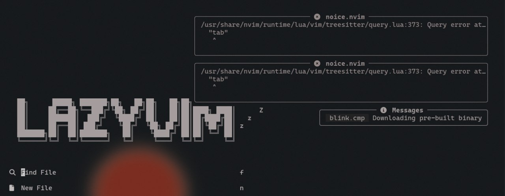

# Zeus Dotfiles

Personal Arch/Omarchy dotfiles (public-safe subset).

## Included

- `~/.config/waybar`
- `~/.config/nvim`
- `~/.config/hypr`

No OpenClaw configs, tokens, secrets, or personal account files are included.

## Screenshots

### Waybar


### Neovim


## Install

> Back up your existing config first.

```bash
# clone
cd ~
git clone https://github.com/<your-username>/zeus-dotfiles.git

# backup existing
mkdir -p ~/.config-backup-$(date +%F)
cp -r ~/.config/waybar ~/.config-backup-$(date +%F)/ 2>/dev/null || true
cp -r ~/.config/nvim ~/.config-backup-$(date +%F)/ 2>/dev/null || true
cp -r ~/.config/hypr ~/.config-backup-$(date +%F)/ 2>/dev/null || true

# apply
cp -r ~/zeus-dotfiles/.config/waybar ~/.config/
cp -r ~/zeus-dotfiles/.config/nvim ~/.config/
cp -r ~/zeus-dotfiles/.config/hypr ~/.config/

# restart waybar / reload hyprland
pkill -x waybar; nohup waybar >/tmp/waybar.log 2>&1 &
hyprctl reload
```

## Notes

- Waybar custom modules rely on local tools (`playerctl`, `cava`, `sensors`, etc.).
- Neovim config is LazyVim-based.
- This repo is intended as a base you can fork and personalize.
